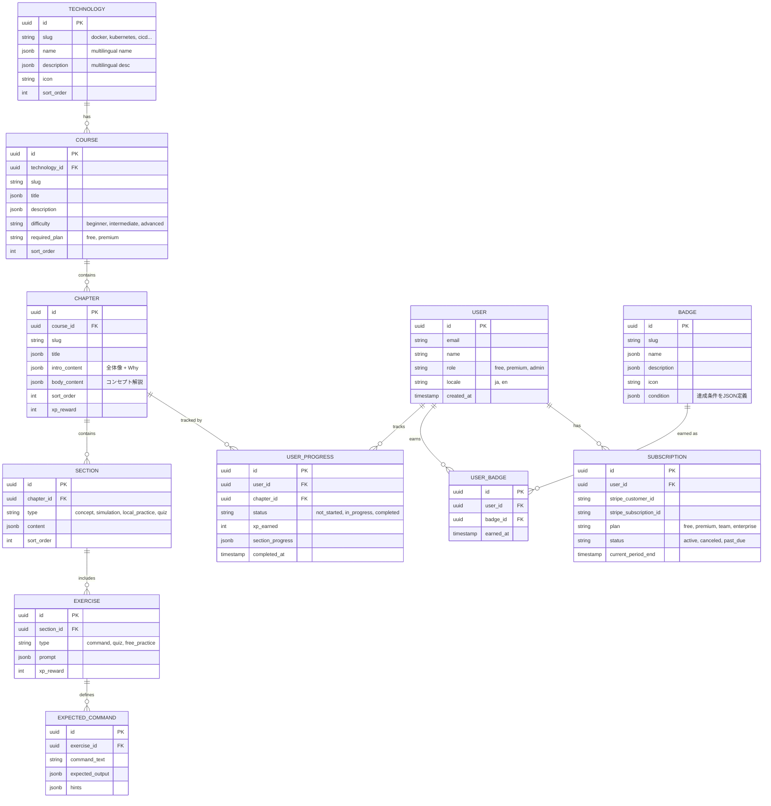

# 🐳 Docker Learning App — ロードマップ & 将来アーキテクチャ

## 全体ロードマップ


---

## Phase 1: MVP（現行計画）

> 詳細は [specification.md](./specification.md) を参照

- Next.js 15 + LocalStorage + シミュレーションターミナル
- Docker基礎〜Compose+環境変数（12章）
- XP・レベル・バッジ / 日英切替

---

## Phase 2: 認証 + クラウドホスティング

### 2.1 クラウドアーキテクチャ


### 2.2 クラウドプロバイダー比較

| 観点 | Azure | AWS | GCP |
|------|-------|-----|-----|
| **Next.js ホスティング** | Azure Static Web Apps / App Service | Amplify / ECS Fargate | Cloud Run / Firebase |
| **DB (PostgreSQL)** | Azure Database for PostgreSQL | RDS / Aurora | Cloud SQL |
| **Redis** | Azure Cache for Redis | ElastiCache | Memorystore |
| **Blob Storage** | Azure Blob Storage | S3 | Cloud Storage |
| **認証との統合** | Azure AD B2C 連携可 | Cognito 連携可 | Firebase Auth 連携可 |
| **コスト（小規模）** | ○ Free Tier あり | ◎ 充実 | ○ Free Tier あり |

> [!TIP]
> **推奨**: 初期はVercel（Next.js最適化）+ Supabase（PostgreSQL + Auth + Blob）でスタートし、スケール時にマネージドクラウドへ移行。Vercelの無料枠で開発・検証コストを抑制可能。

### 2.3 アカウント・認証設計

| 機能 | 技術 |
|------|------|
| OAuth ログイン | NextAuth.js（Google / GitHub / メール） |
| セッション管理 | JWT + Redis |
| ローカル→クラウド移行 | 初回ログイン時にLocalStorageの進捗を自動マージ |
| RBAC | User / Premium / Admin ロール |

```typescript
// ロール定義
enum UserRole {
  FREE = 'free',       // 無料ユーザー
  PREMIUM = 'premium', // 有料プラン
  ADMIN = 'admin',     // 管理者
}

// 既存のUserProgressStoreインターフェースを拡張
// MVP: LocalStorageStore → Phase2: ApiStore への切替
```

---

## Phase 3: マネタイズ

### 3.1 収益モデル: フリーミアム


### 3.2 価格イメージ

| プラン | 月額 | 内容 |
|--------|------|------|
| **Free** | ¥0 | Lv1コース + シミュレーター + 基本辞書 |
| **Premium** | ¥980〜1,480 | 全コース + 全機能 + 広告なし |
| **Team** | ¥780/人 | Premium + チーム管理 + レポート |
| **Enterprise** | 要相談 | Team + SSO + カスタムコンテンツ |

### 3.3 決済基盤

| 要素 | 技術 |
|------|------|
| 決済プロバイダー | **Stripe** |
| サブスクリプション | Stripe Billing（月額/年額） |
| Webhook処理 | Next.js API Routes でStripe Webhook受信 |
| 請求管理 | Stripe Customer Portal |
| プラン判定 | `UserRole` + `subscription_status` でコンテンツゲーティング |

```typescript
// コンテンツゲーティングの仕組み
interface ContentAccess {
  courseId: string;
  requiredPlan: 'free' | 'premium' | 'enterprise';
}

// ミドルウェアでアクセス制御
// middleware.ts → Plan判定 → 無料コンテンツ or 課金誘導
```

---

## Phase 4: コンテンツ拡張

### 4.1 マルチテクノロジー対応 DB設計

> [!IMPORTANT]
> Docker以外のテクノロジー（Kubernetes, CI/CD, Terraform等）を追加できるよう、コンテンツを「テクノロジー非依存」な汎用構造で設計する。



**設計のポイント**:
- `TECHNOLOGY` → `COURSE` → `CHAPTER` の階層で**どのテクノロジーでも同じ構造**
- 全テキストフィールドは `jsonb` で多言語対応（`{"ja": "...", "en": "..."}`）
- `required_plan` でプラン別コンテンツゲーティング
- `EXERCISE` / `EXPECTED_COMMAND` はテクノロジー非依存（Docker以外でも同じ仕組みで演習可能）

### 4.2 コンテンツCMS化

> [!IMPORTANT]
> コンテンツをハードコード（`chapters.ts`）からDB/CMS管理に移行し、非エンジニアでも更新可能にする。自動更新機能の前提基盤。

| 項目 | 内容 |
|------|------|
| **コンテンツDB** | PostgreSQL + jsonb でチャプターデータを管理 |
| **管理画面** | Admin ロール用のCMS UI（コンテンツ編集・プレビュー） |
| **バージョン管理** | コンテンツの変更履歴・ロールバック機能 |
| **APIエンドポイント** | `/api/chapters` でコンテンツ配信 |

### 4.3 コンテンツ自動更新パイプライン

技術ドキュメントのバージョンアップに伴うコンテンツの陳腐化を防ぐため、公式ドキュメントの変更を自動検知し、コンテンツ更新を半自動化する。


#### 実装ステップ

| ステップ | 内容 | 技術 |
|---------|------|------|
| **Step 1** コマンドメタデータ | コマンドにバージョン情報を付与 | `since`, `deprecated`, `replaces` フィールド |
| **Step 2** 差分検出 | Docker公式リリースノート・ドキュメントの変更を定期チェック | GitHub Actions (cron) + Web Scraping |
| **Step 3** 影響分析 | 変更がどのチャプターに影響するか判定 | キーワードマッチ + LLM分類 |
| **Step 4** ドラフト生成 | 影響チャプターの更新案をLLMで自動生成 | GPT / Gemini API |
| **Step 5** レビューフロー | 更新案をPR/Issue化し、人間がレビュー・承認 | GitHub API + 管理画面通知 |

#### コマンドメタデータの例

```typescript
// 将来のデータ構造
interface CommandMeta {
  command: string;          // "docker compose up"
  since: string;            // "v2.0.0"
  deprecated: string | null; // null = 現行
  replaces: string | null;  // "docker-compose up" (旧コマンド)
  docUrl: string;           // 公式ドキュメントURL
  lastVerified: string;     // "2026-02-28" 最終確認日
}
```

#### 対象テクノロジーの監視ソース

| テクノロジー | 監視ソース |
|-------------|------------|
| **Docker** | [docs.docker.com](https://docs.docker.com), [GitHub Releases](https://github.com/docker/cli/releases) |
| **Kubernetes** | [kubernetes.io/docs](https://kubernetes.io/docs), Release Notes |
| **GitHub Actions** | [docs.github.com](https://docs.github.com/en/actions), Changelog |

### 4.4 追加コンテンツ候補

| テクノロジー | 初期コース案 | 優先度 |
|-------------|-------------|--------|
| **Kubernetes** | K8s基礎 → Pod → Deployment → Service | ★★★ Docker の自然な拡張 |
| **CI/CD** | GitHub Actions基礎 → Docker連携 | ★★★ Docker学習者の次ステップ |
| **Terraform** | IaC基礎 → AWS/Azure構築 | ★★ |
| **Linux基礎** | コマンドライン入門 → シェルスクリプト | ★★ Docker前提知識として |
| **Git** | バージョン管理基礎 → チーム開発 | ★ |

### 4.5 コミュニティ機能

| 機能 | 概要 |
|------|------|
| **Q&Aフォーラム** | 章ごとの質問掲示板 |
| **ユーザー投稿チャレンジ** | コミュニティ作成の演習問題(UGC) |
| **学習グループ** | チーム/仲間で進捗を共有 |
| **メンター制度** | 上級者が初心者をサポート（将来） |

---

## Phase 5-6: セキュリティ設計

### 5.1 セキュリティ全体方針

> [!CAUTION]
> 決済・個人情報を扱うため、OWASP Top 10 を基準としたセキュリティ設計を全フェーズで適用する。


### 5.2 フェーズ別セキュリティ対策

| フェーズ | 対策 | 詳細 |
|---------|------|------|
| **MVP** | XSS対策 | ReactのJSXエスケープ + CSP ヘッダー |
| **MVP** | CSRF対策 | SameSite Cookie + CSRF トークン |
| **MVP** | 入力検証 | コマンドシミュレーターのサニタイズ（任意コード実行防止） |
| **Phase 2** | 認証セキュリティ | OAuth 2.0 + PKCE / レート制限 / ブルートフォース対策 |
| **Phase 2** | セッション管理 | HTTP-Only Cookie / Secure flag / 有効期限管理 |
| **Phase 2** | データ暗号化 | DB暗号化(at-rest) / TLS(in-transit) |
| **Phase 3** | 決済セキュリティ | Stripe PCI DSS準拠 / カード情報非保持 / Webhook署名検証 |
| **Phase 3** | アクセス制御 | ミドルウェアでのプラン判定 / 水平権限昇格防止 |
| **Phase 4+** | UGCセキュリティ | 投稿内容のサニタイズ / モデレーション |
| **Phase 5+** | インフラセキュリティ | VPC / セキュリティグループ / Secrets Manager |
| **全フェーズ** | 依存関係管理 | `npm audit` / Dependabot / 定期的な脆弱性スキャン |
| **全フェーズ** | 監査ログ | 認証イベント / 決済イベント / 管理操作の記録 |

### 5.3 コマンドシミュレーター固有のセキュリティ

> [!WARNING]
> シミュレーションターミナルは「ユーザー入力をパースして出力を返す」仕組みだが、将来のローカルDocker連携時に**任意コマンド実行のリスク**が発生する。

| リスク | 対策 |
|--------|------|
| コマンドインジェクション | ホワイトリスト方式（許可コマンドのみ実行可） |
| 危険なコマンド実行 | `docker rm -f`, `docker system prune` 等はブロック/警告 |
| リソース枯渇 | コンテナ数・メモリ制限 / タイムアウト設定 |
| ネットワーク悪用 | 外部通信の制限（ローカルDocker連携時） |

### 5.4 コンプライアンス

| 要件 | 対応 |
|------|------|
| **個人情報保護法** | プライバシーポリシー / 利用規約 / データ削除権 |
| **GDPR**（海外展開時） | Cookie同意 / データポータビリティ / 忘れられる権利 |
| **PCI DSS** | Stripe使用により自社でのカード情報非保持で対応 |
| **特定商取引法** | 有料プラン提供時の表記義務 |

---

## MVP設計時の将来対応チェックリスト

> [!IMPORTANT]
> MVP段階で以下を仕込んでおくことで、将来フェーズへの移行をスムーズにする。

| 対象 | MVP段階でやること | 将来フェーズで拡張 |
|------|-----------------|-------------------|
| **データアクセス** | `UserProgressStore` インターフェース抽象化 | API Store へ差し替え |
| **コンテンツ構造** | JSON定義で `technology > course > chapter` の階層を意識 | DB テーブルへ移行 → CMS化 |
| **コンテンツ鮮度** | コマンドにバージョン情報のメタデータ設計を意識 | 自動更新パイプライン構築 |
| **認証** | ヘッダーに「ログイン」ボタンのプレースホルダー | NextAuth.js 組込み |
| **i18n** | `jsonb` 互換のキー構造で翻訳ファイル管理 | DB の jsonb フィールドへ移行 |
| **セキュリティ** | CSP / XSS / 入力検証を初期実装 | OAuth / 決済セキュリティを追加 |
| **環境変数** | `.env.*` でクラウド設定を分離可能にしておく | クラウドの Secrets Manager へ |
| **コンポーネント設計** | コンテンツ非依存の汎用コンポーネント | 他テクノロジーでも再利用 |
