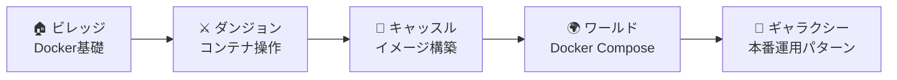
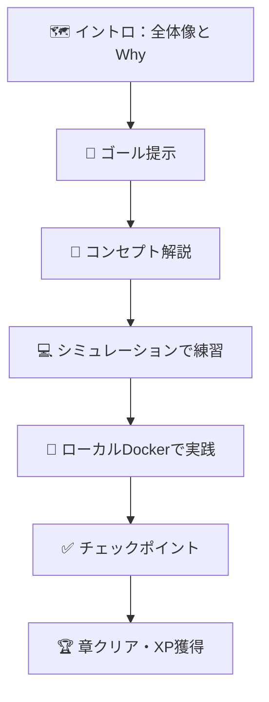
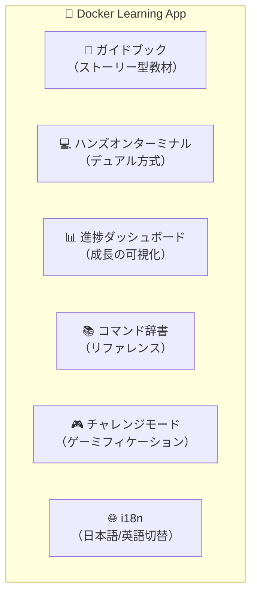

# 🐳 Docker & Docker Compose 学習アプリ — 要件・仕様構成書 v3

## 概要

Docker および Docker Compose を**楽しく・実践的に**学べるWebアプリケーション＋ガイドブック。  
初級者がハンズオン形式で基礎を習得し、中級者以上がリファレンス・復習ツールとして活用できる統合学習プラットフォーム。

> [!NOTE]
> **v3 更新**: 将来要件（クラウド・拡張性・マネタイズ・セキュリティ）を踏まえた設計方針を追加。  
> 将来アーキテクチャ・ロードマップの詳細は → [roadmap.md](./roadmap.md)

---

## 1. ターゲットユーザー

| レベル | ペルソナ | ニーズ |
|--------|---------|--------|
| 🟢 **初級者**（メイン） | PC基本操作・エディタ・プログラミング基礎を知っている | ゼロからDockerを学び、ハンズオンで手を動かしたい |
| 🟡 **中級者** | Dockerの基本は分かるがComposeや実践パターンに弱い | 知識の体系化と実践的なパターン習得 |
| 🔴 **上級者** | 業務でDockerを使用している | コマンド辞書・ベストプラクティス参照・復習用 |

---

## 2. コアコンセプト

### 2.1 学習テーマ「コンテナの冒険」

学習全体を**RPG風の冒険**としてデザインし、楽しく続けられる構造にする。



### 2.2 各章の構造 — 論理的イントロ＋実践

すべての章は以下の統一構造で構成する。特に**冒頭のイントロ**で「全体像」と「なぜこれを学ぶのか」を論理的に提示することを必須とする。



| ステップ | 内容 | 詳細 |
|---------|------|------|
| 🗺️ **イントロ** | この章の全体像とWhy | 「Dockerの世界でこの章はどこに位置するか」を図解。Before/After形式で「なぜこれが必要か」を論理的に説明 |
| 🎯 **ゴール提示** | 何ができるようになるか | 具体的・測定可能なゴールを箇条書きで提示 |
| 📘 **コンセプト解説** | 概念の理解 | 図解・アニメーション付き。比喩を使って直感的に理解できるように |
| 💻 **シミュレーション演習** | ブラウザ内で即座に試す | シミュレーターで安全にコマンドを体験 |
| 🐳 **ローカル実践** | 実際のDockerで実行 | 「では、自分のPCで同じことをやってみましょう」 |
| ✅ **チェックポイント** | 理解度確認 | クイズ / ミニ課題 |
| 🏆 **章クリア** | 達成感の演出 | XP・バッジ獲得、次章への導線 |

### 2.3 なぜ Docker を学ぶのか — ビフォー・アフター提示

各章のイントロで使用するBefore/After表。

| 章 | Before（課題） | After（Docker で解決） |
|----|---------------|----------------------|
| コンテナ基礎 | 「自分のPCでは動くのに…」問題 | どこでも同じ環境を再現 |
| イメージ | 環境構築に毎回数時間 | Dockerfile 1つで一発構築 |
| Compose | 複数サービスの管理が煩雑 | `docker compose up` で全部起動 |
| 環境変数 | 設定がコードにハードコード | 環境ごとに柔軟に切替 |

---

## 3. アプリケーション構成

### 3.1 6つの主要モジュール



### 3.2 各モジュール詳細

---

#### 📖 A. ガイドブック（ストーリー型教材）

**対象**: 主に初級者

- **章立て構成**: §4 カリキュラムに沿ったステップバイステップ教材
- **各章の構造**: §2.2 の統一構造に従う（イントロ → ゴール → 解説 → シミュ → 実践 → チェック → クリア）
- **補足コンテンツ**: コラム、Tips、よくあるミス集

---

#### 💻 B. ハンズオンターミナル（デュアル方式）✅ 決定

**対象**: 全ユーザー

> [!IMPORTANT]
> **デュアル方式採用**: シミュレーション → ローカルDocker実行の2段階学習フロー

**学習フロー**:
```
📖 コンセプト理解
    ↓
💻 シミュレーションターミナルで練習（ブラウザ内で完結）
    ↓
🐳 「実際にやってみよう！」→ ローカルDocker環境で実行
    ↓
✅ 両方で成功 → XP獲得
```

**モード1: シミュレーションターミナル**
- xterm.js ベースのWebターミナルUI
- コマンドごとに事前定義された出力を表示
- ヒント・自動補完・エラーガイド付き
- **どこでも・すぐに**始められる

**モード2: ローカルDockerターミナル**
- ユーザーがPCにインストールしたDocker環境を使用
- アプリは**実行すべきコマンドと期待される結果を提示**
- ユーザーが自分のターミナルで実行し、結果を確認
- オプション: コマンドのコピーボタン付き

**MVP**: シミュレーションターミナルのみ。ローカル実践はガイドテキスト＋コピーボタンで対応。

---

#### 📊 C. 進捗ダッシュボード（成長の可視化）

**対象**: 全ユーザー

- **学習進捗**: カリキュラム全体の完了率（プログレスバー）
- **スキルレーダーチャート**: コンテナ基礎 / イメージ管理 / Compose / 設定管理
- **学習ストリーク**: 連続学習日数
- **レベルシステム**: 経験値に基づくレベルアップ
- **バッジコレクション**: 達成目標に応じたバッジ獲得
- **学習ログ**: コマンド実行履歴

---

#### 📚 D. コマンド辞書（リファレンス）

**対象**: 主に中級者以上

- **コマンド一覧**: カテゴリ別に整理（コンテナ / イメージ / ネットワーク / ボリューム / Compose）
- **各コマンドカード**: 構文 / オプション / 使用例 / 注意点 / 「試す」ボタン
- **検索・フィルタ**: キーワード検索、カテゴリ絞り込み
- **Dockerfile / docker-compose.yml ディレクティブ辞書**

---

#### 🎮 E. チャレンジモード（ゲーミフィケーション）

**対象**: 全ユーザー

| 要素 | 内容 |
|------|------|
| **デイリーチャレンジ** | 毎日1問のDocker課題 |
| **クエスト** | 複数ステップの実践課題 |
| **タイムアタック** | 制限時間内に正しくコマンド入力 |
| **バッジ・実績** | 条件達成で獲得 |
| **レベル・経験値** | 学習活動毎にXP獲得 |

---

#### 🌐 F. 国際化（i18n）· OS環境切替

**言語切替**:
- 対応言語: 日本語（デフォルト）/ 英語
- 翻訳対象: UI / ガイド本文 / コマンド説明 / バッジ名称
- 非翻訳対象: コマンド構文・コード例

**OS環境切替** 🆕:
- 対応: Windows / macOS
- ヘッダーのトグルで即時切替（言語切替と並列配置）
- 切替対象:
  - インストール手順（Docker Desktop for Win / Mac）
  - ターミナル種別（PowerShell / Terminal）
  - ファイルパス表記（`C:\Users\...` / `~/...`）
  - OS固有の注意点（WSL2設定等）
- 切替不要: Dockerコマンド自体（`docker run` 等はOS共通）

> [!TIP]
> i18nと同じ仕組みで管理。`{"ja": ..., "en": ...}` と同様に `{"windows": ..., "mac": ...}` のキーでOS依存テキストを出し分け。

---

## 4. カリキュラム体系（MVP範囲）

> [!IMPORTANT]
> MVPでは**レベル1〜3（Docker基礎 → イメージ → Compose入門＋環境変数）** までをカバー。各章にイントロ（全体像 + Why）を必須配置。

### レベル1: Docker 基礎（初級者向け）

| # | 章タイトル | イントロで伝えること | 学習内容 | ハンズオン |
|---|-----------|-------------------|---------|-----------| 
| 1 | Dockerって何？ | ソフトウェア開発における「環境の壁」問題。Docker が解決する世界観 | コンテナ vs VM、全体像 | `docker version`, `docker info` |
| 2 | はじめてのコンテナ | イメージ→コンテナの関係は「レシピ→料理」。なぜこの分離が重要か | イメージとコンテナ | `docker run hello-world` |
| 3 | コンテナを操る | アプリのライフサイクル管理。なぜ起動・停止・削除を知る必要があるか | 起動・停止・削除 | `docker run/stop/rm/ps` |
| 4 | コンテナの中に入ろう | デバッグや確認のために中に入る必要性。対話操作が開発をどう助けるか | 対話モード、exec | `docker run -it`, `docker exec` |
| 5 | ポートを開こう | コンテナは孤立している。外部と繋ぐことでWebサービスとして公開できる | ポートマッピング | `docker run -p` + ブラウザ確認 |
| 6 | データを永続化 | コンテナは消えたらデータも消える。永続化の必要性とその方法 | ボリューム、バインドマウント | `docker volume`, `-v` |

### レベル2: Dockerfile & イメージ（初〜中級者向け）

| # | 章タイトル | イントロで伝えること | 学習内容 | ハンズオン |
|---|-----------|-------------------|---------|-----------| 
| 7 | Dockerfileを書こう | 手動セットアップの限界。「環境構築を自動化する設計図」としてのDockerfile | FROM, RUN, COPY, CMD | Dockerfile作成 → `docker build` |
| 8 | レイヤーを理解する | なぜビルドが遅い/速いが変わるか。効率的なイメージ設計の鍵 | レイヤーキャッシュ、.dockerignore | `docker history`, ビルド最適化 |
| 9 | マルチステージビルド | 本番イメージを軽量に保つ理由。ビルド環境と実行環境の分離の意味 | ビルド用/実行用の分離 | サイズ比較 |

### レベル3: Docker Compose 入門（中級者向け）— MVP最終レベル

| # | 章タイトル | イントロで伝えること | 学習内容 | ハンズオン |
|---|-----------|-------------------|---------|-----------| 
| 10 | Composeの世界へ | 実サービスは複数コンテナで構成される。手動管理の限界とComposeの価値 | YAMLの基本、docker-compose.yml | `docker compose up/down` |
| 11 | 複数サービスを連携 | WebアプリとDBはなぜ別コンテナにするか。マイクロサービス的発想 | サービス間通信、depends_on | Web + DB構成 |
| 12 | 環境変数と設定 | 同じコードで開発・本番を切り替える。設定の外部化がなぜ重要か | .env、environment、configs | 設定の外部化 |

### レベル4: 実践パターン（MVP後に追加）

| # | 章タイトル | 学習内容 |
|---|-----------|---------| 
| 13 | 本番を意識した構成 | profiles, healthcheck, restart |
| 14 | ネットワーク深掘り | bridge, host, overlay |
| 15 | セキュリティ基礎 | 非rootユーザー、secrets |
| 16 | CI/CDとDocker | GitHub Actions連携 |
| 17 | トラブルシューティング | logs, inspect, デバッグ |

---

## 5. ゲーミフィケーション設計

### 5.1 経験値（XP）テーブル

| アクション | XP |
|-----------|-----|
| イントロ読了 | 5 |
| コンセプト解説読了 | 10 |
| シミュレーションコマンド成功 | 20 |
| ローカルDocker実践完了 | 30 |
| チェックポイント正解 | 30 |
| 章クリア | 100 |
| デイリーチャレンジ完了 | 50 |
| クエスト完了 | 200 |
| 連続学習ボーナス（3日目〜） | ×1.5 |

### 5.2 レベル・バッジ

| レベル帯 | 称号 | 必要XP |
|---------|------|--------|
| 1-5 | 🐣 コンテナビギナー | 0 - 500 |
| 6-10 | 🐋 ドッカーアプレンティス | 501 - 1500 |
| 11-15 | ⚓ コンテナセーラー | 1501 - 3500 |
| 16-20 | 🏗️ イメージアーキテクト | 3501 - 7000 |
| 21-25 | 🎼 コンポーズマエストロ | 7001 - 12000 |
| 26-30 | 🐳 ドッカーマスター | 12001+ |

**バッジ例**: 🎉 First Container / 📦 Image Builder / 🔗 Compose Conductor / 🔥 7-Day Streak / ⚡ Speed Runner

---

## 6. 技術アーキテクチャ ✅ 確定

### 6.1 フレームワーク比較・選定

| 観点 | **Next.js** ✅ 採用 | Vite + React | HTML + JS |
|------|------------------|-------------|-----------|
| **SSG/SSR** | ✅ ガイドブックをSSGで高速配信 | ❌ CSRのみ（プラグインで可） | ❌ なし |
| **i18n** | ✅ next-intl でルーティング統合 | △ react-i18next（ルーティング手動） | △ 自前実装 |
| **ファイルベースルーティング** | ✅ App Router で章ごとのページ自動生成 | ❌ react-router 手動設定 | ❌ 手動 |
| **API Routes** | ✅ 将来のバックエンド統合に活用可能 | ❌ 別途Express等が必要 | ❌ 別途必要 |
| **将来のアカウント機能** | ✅ API Routes + NextAuth.js で統合しやすい | △ 別バックエンド必要 | △ 別バックエンド必要 |
| **エコシステム** | ✅ 最大、参考資料豊富 | ○ 十分 | △ 限定的 |
| **ビルドサイズ** | △ やや大きい | ✅ 軽量 | ✅ 最軽量 |
| **学習コスト** | △ App Router の習得が必要 | ✅ シンプル | ✅ 最もシンプル |

> [!NOTE]
> **結論**: Next.js を採用。ガイドブックのSSG配信、i18nルーティング、将来のアカウント機能（NextAuth.js + API Routes）との親和性が決め手。Viteの唯一の優位点（軽量さ・シンプルさ）はこのプロジェクト規模では大きな差にならない。

### 6.2 技術スタック ✅ 確定

| 領域 | 技術 | 理由 |
|------|------|------|
| **フロントエンド** | Next.js 15 (App Router) | SSG + i18n + 将来のAPI Routes |
| **UIスタイル** | Vanilla CSS + CSS Modules | 高いカスタマイズ性、フレームワーク非依存 |
| **ターミナルUI** | xterm.js | 実績のあるWebターミナルライブラリ |
| **i18n** | next-intl | Next.js App Router との深い統合 |
| **データ永続化** | LocalStorage + IndexedDB | MVP段階。データアクセス層を抽象化し将来のDB移行に備える |
| **将来のAuth** | NextAuth.js（予定） | Next.js API Routes と統合 |
| **将来のDB** | PostgreSQL or Supabase（予定） | アカウント機能追加時 |

### 6.3 データ永続化設計: 将来のクラウド・マネタイズ移行を見据えた抽象化

```typescript
// データアクセス層の抽象化（設計方針）
interface UserProgressStore {
  getProgress(chapterId: string): Promise<ChapterProgress>;
  saveProgress(chapterId: string, progress: ChapterProgress): Promise<void>;
  getXP(): Promise<number>;
  addXP(amount: number): Promise<void>;
  getBadges(): Promise<Badge[]>;
  unlockBadge(badgeId: string): Promise<void>;
}

// MVP: LocalStorageStore implements UserProgressStore
// Phase 2: ApiStore implements UserProgressStore → サーバーAPI + PostgreSQL
// Phase 3: PremiumStore extends ApiStore → プラン判定付きアクセス
```

> [!TIP]
> `UserProgressStore` インターフェースを通じてデータアクセスを行うことで、MVP(LocalStorage) → Phase2(API + DB) → Phase3(課金連携)への移行を**コンポーネント側のコード変更なし**で実現可能。

> [!IMPORTANT]
> MVP段階でのコンテンツJSON構造は、将来のDB移行（`technology > course > chapter > section` 階層）を意識した設計とする。詳細なER図は [roadmap.md](./roadmap.md) §Phase 4 を参照。

### 6.4 ターミナル実装方式 ✅ 確定

**デュアル方式**:

| フェーズ | 方式 | 実装 |
|---------|------|------|
| **MVP** | シミュレーションターミナル | xterm.js + コマンドパーサー + JSON定義の期待出力 |
| **MVP** | ローカル実践ガイド | ガイドテキスト + コマンドコピーボタン + 期待出力表示 |
| **将来** | ローカルDocker統合 | ローカルHelperアプリ経由で実際のDocker実行 |

**シミュレーション方式の仕組み**:
```
ユーザー入力 → コマンドパーサー → コマンドマッチ
  ├── 完全一致: 期待される出力を表示 + XP付与
  ├── 部分一致: ヒント表示（「もう少し！」）
  └── 不一致: エラーメッセージ + ヘルプ表示
```

---

## 7. 画面構成（ワイヤーフレーム概要）

```
┌─────────────────────────────────────────────────────┐
│  🐳 Docker Quest  [🪟|🍎] [JP|EN]  [👤 Lv.7]  [🔔] │
├──────────┬──────────────────────────────────────────┤
│          │                                          │
│ 📖 ガイド │  ┌─ 🗺️ イントロ ──────────────────┐     │
│ 💻 演習   │  │ この章の全体像 & なぜ学ぶのか    │     │
│ 📚 辞書   │  └────────────────────────────────┘     │
│ 🎮 チャレ │  ┌─ 📘 コンセプト解説 ──────────┐       │
│ 📊 進捗   │  │  テキスト + 図解 + アニメ      │       │
│          │  └────────────────────────────────┘     │
│          │  ┌─ 💻 シミュレーション ──────────┐     │
│          │  │  $ docker run hello-world ▌    │     │
│          │  │  > Hello from Docker! ...      │     │
│          │  └────────────────────────────────┘     │
│          │  ┌─ 🐳 ローカル実践 ──────────────┐     │
│          │  │  「自分のPCでも試してみよう！」    │     │
│          │  │  [コマンドをコピー] [完了報告]    │     │
│          │  └────────────────────────────────┘     │
├──────────┴──────────────────────────────────────────┤
│  📊 XP: ████████░░ 720/1000   🏆 x5   🔥 3日連続  │
└─────────────────────────────────────────────────────┘
```

---

## 8. MVP スコープ ✅ 確定

### MVP に含めるもの

- ✅ ガイドブック（レベル1-3: 全12章、各章にイントロ付き）
- ✅ シミュレーションターミナル（基本〜Composeコマンド対応）
- ✅ ローカル実践ガイド（テキスト + コピーボタン形式）
- ✅ 進捗トラッキング（章の完了率、データアクセス層抽象化済み）
- ✅ XP・レベルシステム
- ✅ 基本バッジ
- ✅ 日本語/英語切替
- ✅ Windows/Mac OS切替（ガイドテキスト・パス表記の出し分け）
- ✅ コマンド辞書（基本〜Composeコマンド）

### MVP 後に追加

- ⬜ レベル4: 実践パターン（5章分）
- ⬜ デイリーチャレンジ / クエスト / タイムアタック
- ⬜ リーダーボード
- ⬜ ローカルDocker統合（Helperアプリ方式）
- ⬜ ユーザーアカウント + NextAuth.js + DB移行
- ⬜ チートシートPDF生成

---

## 9. 実装計画

### フェーズ1: 基盤構築（1-2週目）

| 作業 | 詳細 |
|------|------|
| プロジェクト初期化 | Next.js 15 App Router + TypeScript |
| デザインシステム | CSS Variables、タイポグラフィ、カラーパレット |
| i18n セットアップ | next-intl 導入、日英翻訳ファイル構造 |
| レイアウト | サイドバー + メインエリア + フッターXPバー |
| データアクセス層 | `UserProgressStore` インターフェース + LocalStorage実装 |

### フェーズ2: コア機能（3-4週目）

| 作業 | 詳細 |
|------|------|
| ターミナルUI | xterm.js + コマンドシミュレーター実装 |
| ガイドコンテンツ | レベル1-3（12章分）各章イントロ付き |
| ローカル実践ガイド | コマンドコピー + 完了報告UI |
| 進捗管理 | ダッシュボード + レーダーチャート |

### フェーズ3: ゲーミフィケーション（5-6週目）

| 作業 | 詳細 |
|------|------|
| XP・レベルシステム | 経験値計算・レベルアップ演出 |
| バッジシステム | 条件判定・獲得アニメーション |
| コマンド辞書 | 検索・フィルタ付きリファレンス |

### フェーズ4: ポリッシュ（7-8週目）

| 作業 | 詳細 |
|------|------|
| アニメーション | マイクロインタラクション、遷移アニメ |
| レスポンシブ対応 | タブレット・モバイル最適化 |
| パフォーマンス最適化 | コード分割、遅延読み込み |

---

## 10. 検証計画

### 自動テスト
- **ユニットテスト**: コマンドシミュレーター、データアクセス層（Jest/Vitest）
- **E2Eテスト**: ガイド章送り、ターミナル操作、i18n切替（Playwright）

### ブラウザ確認
- 各ページの表示・動作確認
- ターミナルでのコマンド入力・結果表示
- 言語切替の即時反映

### ユーザーテスト
- Docker未経験者に全12章を通しで実施、理解度・楽しさをヒアリング

---

## ✅ 決定事項まとめ

| 項目 | 決定 |
|------|------|
| ターミナル | デュアル方式（シミュ → ローカルDocker）。MVPはシミュ＋ガイドテキスト |
| フレームワーク | Next.js 15 (App Router) |
| データ永続化 | LocalStorage（UserProgressStore抽象化で将来 DB + 課金連携に対応） |
| MVP範囲 | レベル1-3（Docker基礎 → イメージ → Compose＋環境変数）全12章 |
| 各章構造 | 冒頭に「全体像 + なぜ学ぶのか」の論理的イントロを必須配置 |
| OS切替 | Windows/Mac トグル。ガイドテキスト・パス・インストール手順を出し分け（i18nと同じ仕組み） |
| 将来要件 | クラウドホスティング / マルチテクノロジー拡張 / フリーミアム課金 / 多層セキュリティ |

> 将来アーキテクチャ・ロードマップの全体像 → [roadmap.md](./roadmap.md)
